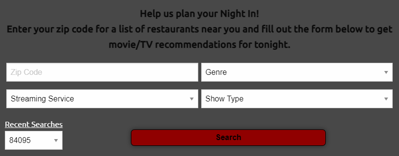
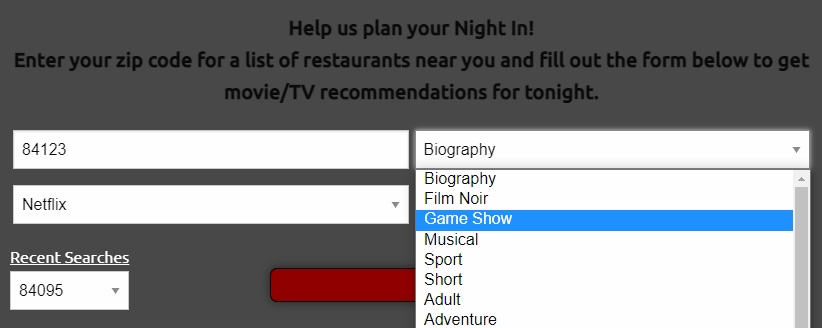

# A Night In

## Description
A website that allows the user to create a personalized night in complete with a movie or TV show + restaurant of choice. The user will input their zip code, select a streaming service, genre, and media type from a dropdown to show local restaurants and available movies. A list of recent zip codes searched will also be available to use. The list of local restaurants includes the restaurant contact information and, when clicked, it will navigate to the Google Maps for that restaurant. When the user clicks on a movie, it will navigate them to the streaming service to watch the movie.

# Link
See deployed application [here](https://alyssawinn.github.io/a-night-in/)

# Screenshots

